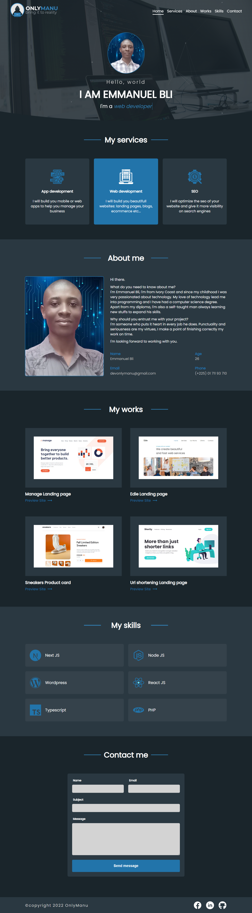

<h1 align="center">OnlyManu Portofolio</h1>

<div align="center">
    This is a [Next.js](https://nextjs.org/) project bootstrapped with [`create-next-app`](https://github.com/vercel/next.js/tree/canary/packages/create-next-app).
</div>

<div align="center">
  <h3>
    <a href="https://onlymanu.vercel.app/">
      Live view
    </a>
    <span> | </span>
    <a href="https://github.com/OnlyManu/onlymanu-portofolio">
      Code
    </a>
  </h3>
</div>

<!-- TABLE OF CONTENTS -->

## Table of Contents

- [Overview](#overview)
  - [Built With](#built-with)
- [How to use](#how-to-use)
- [Contact](#contact)

<!-- OVERVIEW -->

## Overview



This is a my portofolio website.

### Built With

<!-- This section should list any major frameworks that you built your project using. Here are a few examples.-->

- [Next.js](https://nextjs.org/)
- [React.js](https://reactjs.org/)
- JS
- HTML
- CSS

## How to use

- Install the dependencies

```bash
npm instal
# or
yarn
```

- Run the development server:

```bash
npm run dev
# or
yarn dev
```

- Open [http://localhost:3000](http://localhost:3000) with your browser to see the result.

## Contact

- GitHub [@OnlyManu](https://github.com/OnlyManu)
- Facebook [@OnlyManu](https://www.facebook.com/profile.php?id=100088412454361)
